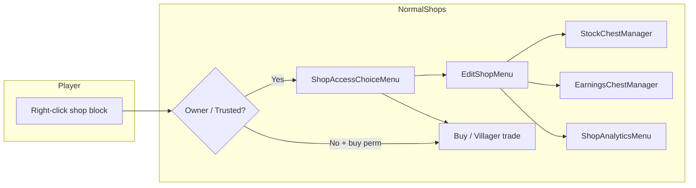

<div align="center">

# NormalShops

### Player-owned shops for Paper & Spigot — GUIs, stockpiles, earnings, analytics, and staff tools

[](https://papermc.io/)
[](https://adoptium.net/)
[](https://docs.papermc.io/)

**Authors:** GameChampCrafted · Ridewithit

*Forked and extended from the original [ClickShop](https://www.spigotmc.org/resources/clickshop.111190/) concept — rebuilt identity, permissions, and feature set.*

<br/>

[Features](#feature-overview) ·
[Installation](#installation) ·
[Quick start](#quick-start) ·
[Permissions](#permissions) ·
[Commands](#commands) ·
[Configuration](#configuration) ·
[Full feature guide](#detailed-feature-guide)

</div>

---

<br/>

## Why NormalShops?

NormalShops turns chests and barrels into **fully interactive player shops** without forcing players through obscure commands. Owners get a **polished editor**, buyers get a **clear purchase flow** (classic GUI *or* villager-style trading), and staff get **real tools** — history, emulation, ownership transfer — backed by optional **CoreProtect** integration.

Whether you run a survival economy or a mini-game hub, NormalShops is built to feel **native to Minecraft**: signs, chests, sounds, and inventories players already understand.

---

<br/>

## Feature overview

<table>
<tr>
<td width="50%" valign="top">

### Core shop experience

| Capability | Description |
|------------|-------------|
| **Block-based shops** | Create shops on **chests** or **barrels** using a **sign** (any wood). |
| **Price & products** | Set a currency item (and amount) plus one or more products — including custom items, heads, and NBT-heavy goods when configured. |
| **Buy flow** | Customers use either a **Buy GUI** or a **villager merchant** interface (configurable via `villager-trading-menu`). |
| **Stockpiles** | Link remote chest inventories so sold items pull from real storage — with per-shop limits and optional **stockpile protection**. |
| **Earnings** | Sales credit **internal earnings**; owners withdraw through a **paged earnings chest** (partial pickups, stacked bundles). |
| **Custom displays** | Glass and item-frame style **shop displays**, themes, colors, and optional **sale text** on glass. |
| **Sounds & themes** | Per-shop **buy sounds** and **menu color themes** for personality. |

</td>
<td width="50%" valign="top">

### Owner & team tools

| Capability | Description |
|------------|-------------|
| **Trusted players** | Grant **trusted** access so helpers can manage stock and settings without owning the shop. |
| **Access choice menu** | Owners/trusted users pick **Editor** vs **customer trade view** so they can preview exactly what buyers see. |
| **Unlimited internal stock** | Internal stock is **not capped** at 27 slots — use **paged stock chest** editing (45 slots per page + navigation). |
| **Lifetime analytics** | Revenue, sales count, products sold, impressions, stock added/removed, net change, utilization, conversion rate. |
| **Buyer insights** | **Unique buyers** and **top buyers** derived from real purchase history. |
| **Market comparison** | See how **other shops** price overlapping products and open a **paginated competitor list**. |
| **Shop info card** | Quick **stats lore** in the editor (including **total impressions**). |

</td>
</tr>
</table>

---

<br/>

## Detailed feature guide

<details open>
<summary><strong>Creating & editing shops</strong></summary>

<br/>

1. Hold **any wooden sign** and **right-click** a **chest** or **barrel** to open the creation GUI.
2. Place your **price** (what buyers pay) and **products** (what they receive) in the designated areas.
3. Click **Create Shop** to finalize.

**Editor controls (create / change product menus):**

- **Left-click** with an item to place it in a slot.
- **Right-click** with an **empty hand** to halve the amount in a slot.
- **Right-click** with the **same item** as the slot to increase the amount by one.

After creation, **right-click** your shop block as the owner (or trusted player) to open the **access menu**: choose **Open Editor** for management or **Open Trade** for the buyer-facing experience.

</details>

<details>
<summary><strong>Buying — GUI mode vs villager mode</strong></summary>

<br/>

- **`villager-trading-menu: true` (default):** Buyers interact through a **merchant** window. Multi-product bundles appear as a **highlighted chest** recipe (contents stored in block state meta) with **preview-only** rows using a **barrier** as the fake “price” so the real product stays obvious.
- **`false`:** Buyers use the classic **BuyMenu** chest GUI instead.

**Out of stock:** Buyers can still **open** the trade view for transparency. The title reflects stock state (e.g. in stock vs out of stock). For non-admin shops, **fulfilling trades is blocked** when there is nothing to deliver — no ghost purchases.

**Impressions:** Opening buy/trade flows can increment **lifetime impressions** for conversion analytics.

</details>

<details>
<summary><strong>Stock management (paged stock chest)</strong></summary>

<br/>

- Internal stock is stored as a **logical list** with **pagination** (45 item slots per page + prev/next/info/**back to editor**).
- **One player at a time** may view a shop’s stock GUI to reduce exploit surface.
- Opening stock is **blocked** while another player has an **active villager trade session** on that shop (and vice versa).
- **Revision counters** detect external changes (e.g. a sale while editing) and **refresh or invalidate** stale views.
- Stockpile-backed removal still integrates with **Transaction** logic.

</details>

<details>
<summary><strong>Earnings (paged earnings chest)</strong></summary>

<br/>

- **Collect** opens a **dedicated earnings inventory** instead of dumping everything into the player’s inventory at once.
- Owners take **partial withdrawals**; bundles can **stack** in the GUI for readability.
- The **top (earnings) inventory is withdraw-only** — players cannot deposit or shift-click **into** earnings slots; their **own inventory** remains freely movable.
- Same **single-viewer** and **revision** philosophy as stock.

</details>

<details>
<summary><strong>Stockpiles & earnings piles</strong></summary>

<br/>

- **Stockpiles:** Connect additional chests to supply sold items. Optional **`protect-stockpiles`** keeps foreign players from opening linked chests (bypass: `normalshops.bypass-stockpile`).
- **Earnings piles:** Central chests that aggregate payouts from multiple shops (subject to limits in `config.yml`).
- **Tethers:** Optional **particle / rope visualization** while linking (`visualize-tethers`).
- **Double chests:** Pile locations are **canonicalized** so left/right halves resolve to one logical pile.

</details>

<details>
<summary><strong>Customization & polish</strong></summary>

<br/>

- **Menu colors**, **custom shop names** (length-limited), **sale text** on displays.
- **Frame & glass displays** with lights, layering, and “move to top” style controls.
- **Per-shop notifications** and **low-stock warnings** in settings.
- **Unlimited stock** mode exists for special cases (gated behind **`normalshops.unlimited-stock`** — intentionally dangerous on economy servers).

</details>

<details>
<summary><strong>Administration & audit trail</strong></summary>

<br/>

**Shift + right-click** a shop with **`normalshops.delete`** to open the **admin / delete hub** — including on **your own** shops.

| Admin control | What it does |
|---------------|----------------|
| **Delete shop** | Remove the listing (with optional operator earnings collection via config). |
| **Force edit** | Open the full **owner editor** as staff to adjust price, stock, display, etc. |
| **Force change owner** | Prompts for a **username in chat**; transfers ownership safely via `ShopManager`. |
| **Shop history** | Paginated **persistent** per-shop log (buys, edits, connects, emulated sales, villager buys, …). Falls back to **CoreProtect block lookup** when needed. |
| **Emulate sale** | Runs a **synthetic transaction** (stock + earnings + stats + logging) for testing or moderation — tagged distinctly in logs (`NormalShops-EmulatedSale`). |

**CoreProtect (optional):** If CoreProtect is present and its API is enabled, NormalShops records **interaction-style** logs for creates, deletes, buys (GUI & villager), stockpile changes, earnings collection, connects/disconnects, and more — while also appending structured lines to **in-plugin history** for the GUI.

</details>

<details>
<summary><strong>Safety & anti-dupe design</strong></summary>

<br/>

- **Editor session lock:** Only one management session “owns” deep edits at a time; submenus respect the same lock messaging.
- **Management access checks** on open and click: if a trusted player is **removed** while online, GUIs **stop accepting actions** and can close safely.
- **Stock / earnings revisions** + **exclusive viewers** reduce race windows between GUIs, merchants, and async saves.
- **Fulfillment checks** on villager trades ensure stock is actually removed before counting revenue or sales.

</details>

---

<br/>

## Architecture at a glance



---

<br/>

## Installation

1. **Server:** Paper or Spigot **1.20.x** (API `1.20` as declared in `plugin.yml`).
2. **Java:** **17** (see `build.gradle`).
3. Drop **`NormalShops.jar`** into `plugins/`.
4. **Optional:** Install **[CoreProtect](https://www.spigotmc.org/resources/coreprotect.8631/)** for external block history and richer audit trails.
5. Restart once, then tune `plugins/NormalShops/config.yml` and language files under `plugins/NormalShops/messages/`.

> **Migrating from ClickShop?** Rename `plugins/ClickShop` → `plugins/NormalShops` **or** copy `data.yml` and the `shops/` folder. Re-map all permissions from `clickshop.*` to **`normalshops.*`**. Commands are now **`/normalshops`** (alias **`/nshops`**).

---

<br/>

## Quick start

| Step | Action |
|------|--------|
| 1 | Get a **sign** (any wood) and **right-click** a **chest** or **barrel**. |
| 2 | Set **price** and **products** in the GUI, then **Create Shop**. |
| 3 | **Right-click** the shop block to manage or preview the buyer view. |
| 4 | Use **Stock chest** in the editor to add paged internal stock. |
| 5 | Use **Collect** to open the **earnings chest** and withdraw profits. |
| 6 | Link **stockpiles** / **earnings piles** from the editor when you outgrow a single block. |

---

<br/>

## Permissions

All nodes are prefixed with **`normalshops.`**.

| Permission | Default | Purpose |
|------------|---------|---------|
| `normalshops.create` | `true` | Create new shops |
| `normalshops.buy` | `true` | Purchase from shops |
| `normalshops.customize` | `true` | Open customization flows |
| `normalshops.display` | `true` | Build advanced displays *(needs customize)* |
| `normalshops.sale-text` | `true` | Edit floating sale text *(needs customize)* |
| `normalshops.stockpile` | `true` | Connect stockpiles |
| `normalshops.earnings-pile` | `true` | Connect earnings piles |
| `normalshops.delete` | `op` | Admin hub + delete anyone’s shop |
| `normalshops.bypass-stockpile` | `op` | Open protected foreign stockpiles |
| `normalshops.unlimited-stock` | `op` | Toggle dangerous unlimited stock |
| `normalshops.reload` | `op` | `/normalshops reload` |
| `normalshops.coreprotect-test` | `op` | Developer API self-test |
| `normalshops.coreprotect-debug` | `op` | Verbose CoreProtect diagnostics |

---

<br/>

## Commands

| Command | Description |
|---------|-------------|
| **`/normalshops reload`** | Reload `config.yml` and message bundles (alias: **`/nshops`**). |

---

<br/>

## Configuration

Key files live in **`plugins/NormalShops/`**:

| File | Role |
|------|------|
| `config.yml` | Language, limits, stockpile protection, piston rules, recovery mode, **villager GUI toggle**, NBT strictness, distances, display range, etc. |
| `messages/*.yml` | Localizable strings (ships with **English** and **German**). |
| `data.yml` + `shops/*.yml` | Serialized `ShopManager`, per-player managers, and per-shop files. |

**Highlighted options:**

| Key | What it controls |
|-----|------------------|
| `language` | Message bundle (`en_US`, `de_DE`, …). |
| `protect-stockpiles` | Lock foreign access to linked supply chests. |
| `villager-trading-menu` | Use merchant UI vs classic buy GUI for customers. |
| `full-nbt-check` | Stricter matching for advanced items (economy servers). |
| `max-connection-distance` | How far connectors can reach. |
| `shop-limit-per-player` / pile limits | Hard caps to protect performance. |
| `recover-shop-files` | **Emergency** resync — auto-disables after one run. |

> The shipped `config.yml` still documents a **`check-update`** flag from upstream; the in-plugin Spigot update checker may be absent in this fork — rely on your own release process.

---

<br/>

## Building from source

```bash
./gradlew clean build
```

Artifact: `build/libs/NormalShops-<version>.jar` (version from `gradle.properties`).

**Dependencies (compile-only):** Spigot API **1.20.1**, JetBrains annotations, CoreProtect API **23.0**.

---

<br/>

## Support & contributing

- **Issues:** Use GitHub Issues for reproducible bugs (include server version, plugin list, and steps).
- **PRs:** Keep changes focused; match existing code style and avoid unrelated refactors.

---

<br/>

## License

See [`LICENSE.md`](LICENSE.md). NormalShops retains upstream licensing expectations; attribution to original ClickShop inspiration is noted there.

---

<div align="center">

**NormalShops** — GameChampCrafted & Ridewithit

</div>
